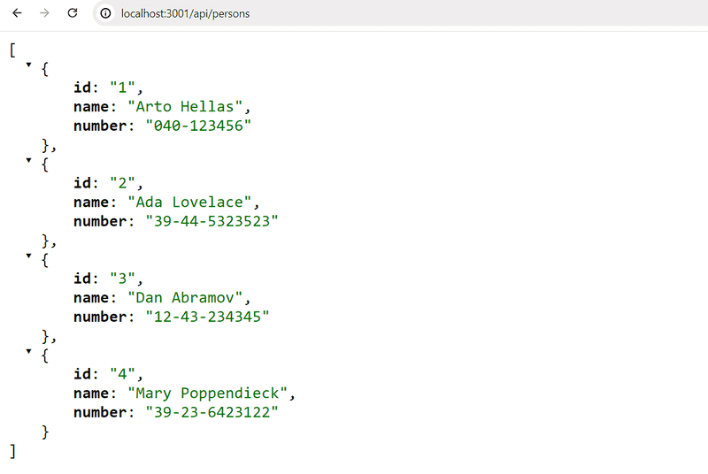
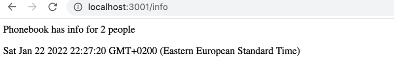
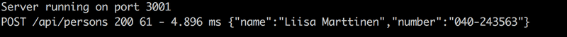
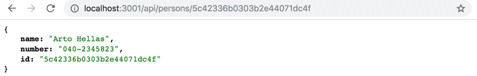

# Parte 3

## Ejercicios 3.1-3.6

>NB: Se recomienda hacer todos los ejercicios de esta parte en un nuevo repositorio de git y colocar tu código fuente directamente en la raíz del repositorio. De lo contrario, tendrás problemas en el ejercicio 3.10.

>NB: Dado que este no es un proyecto de frontend y no estamos trabajando con React, la aplicación no se crea con create vite@latest -- --template react. Inicias este proyecto con el comando npm init que se demostró anteriormente en esta parte del material.

Fuerte recomendación: Cuando estés trabajando en código del lado del servidor, siempre mantén un ojo en lo que sucede en la terminal que está ejecutando tu aplicación.

## 3.1: Backend de la Agenda Telefónica paso 1

Implementa una aplicación Node que devuelva una lista codificada de entradas de la agenda telefónica desde la dirección
`http://localhost:3001/api/persons`.

Datos:

```js
[
    { 
      "id": 1,
      "name": "Arto Hellas", 
      "number": "040-123456"
    },
    { 
      "id": 2,
      "name": "Ada Lovelace", 
      "number": "39-44-5323523"
    },
    { 
      "id": 3,
      "name": "Dan Abramov", 
      "number": "12-43-234345"
    },
    { 
      "id": 4,
      "name": "Mary Poppendieck", 
      "number": "39-23-6423122"
    }
]
```

Salida en el navegador después de la solicitud GET:


Observa que la barra inclinada hacia adelante en la ruta **api/persons** no es un carácter especial y es como cualquier otro carácter en la cadena.

La aplicación debe iniciarse con el comando **npm start**.

La aplicación también debe ofrecer un comando **npm run dev** que ejecutará la aplicación y reiniciará el servidor cada vez que se hagan cambios en un archivo en el código fuente.

## 3.2: Backend de la Agenda Telefónica, paso 2

Implementa una página en la dirección `http://localhost:3001/info` que se parezca más o menos a esto:


La página tiene que mostrar la hora en que se recibió la solicitud y cuántas entradas hay en la agenda telefónica en el momento de procesar la solicitud.

Solo puede haber una declaración `response.send()` en una ruta de la aplicación **Express**. Una vez que envías una respuesta al cliente usando `response.send()`, el ciclo de solicitud-respuesta está completo y no se pueden enviar más respuestas.

Para incluir un espacio en blanco en la salida, utiliza la etiqueta `<br/>` o envuelve las declaraciones en etiquetas `<p>`.

## 3.3: Backend de la Agenda Telefónica, paso 3

Implementa la funcionalidad para mostrar la información de una sola entrada de la agenda.

La URL para obtener los datos de una persona con la identificación `5` debe ser `http://localhost:3001/api/persons/5`

Si no se encuentra una entrada para la identificación dada, el servidor debe responder con el código de estado apropiado.

## 3.4: Backend de la Agenda Telefónica, paso 4

Implementa la funcionalidad que hace posible eliminar una sola entrada de la agenda telefónica mediante una solicitud HTTP DELETE a la URL única de esa entrada de la agenda.

Prueba que tu funcionalidad funcione con _Postman_ o el _cliente REST de Visual Studio Code_.

## 3.5: Backend de la Agenda Telefónica, paso 5

Expande el backend para que se puedan agregar nuevas entradas a la agenda telefónica realizando solicitudes HTTP POST a la dirección `http://localhost:3001/api/persons`.

Genera un nuevo `id` para la entrada de la agenda con la función `Math.random`. Utiliza un rango lo suficientemente grande para tus valores aleatorios de modo que la probabilidad de crear IDs duplicados sea pequeña.

## 3.6: Backend de la Agenda Telefónica, paso 6

Implementa el manejo de errores para crear nuevas entradas.

No se permite que la solicitud se realice correctamente si:

- Falta el nombre o el número
- El nombre ya existe en la agenda

Responde a solicitudes como estas con el código de estado apropiado y también envía información que explique el motivo del error, por ejemplo:

```js
{ error: 'name must be unique' }
```

## 3.7: Backend de la Agenda Telefónica, paso 7

Agrega el middleware [**morgan**](https://github.com/expressjs/morgan) a tu aplicación para el registro de mensajes. Configúralo para registrar mensajes en tu consola según la configuración _tiny_.

La documentación de Morgan no es la mejor y es posible que debas dedicar algún tiempo a averiguar cómo configurarlo correctamente.
Sin embargo, la mayor parte de la documentación del mundo cae en la misma categoría, por lo que es bueno aprender a descifrar e interpretar documentación críptica en cualquier caso.

Morgan se instala como todas las demás librerías con el comando `npm install`.
La puesta en funcionamiento de Morgan ocurre de la misma manera que la configuración de cualquier otro middleware mediante el comando `app.use`.

## 3.8*: Backend de la Agenda Telefónica, paso 8

Configura **morgan** para que también muestre los datos enviados en las solicitudes **HTTP POST**:


Ten en cuenta que el registro de datos incluso en la consola puede ser peligroso,
ya que puede contener datos confidenciales y puede violar la ley de privacidad local
(por ejemplo, GDPR en la UE) o el estándar comercial.

En este ejercicio, no tienes que preocuparse por los problemas de privacidad, pero en la práctica,
intenta no registrar ningún dato sensible.

Este ejercicio puede resultar bastante complicado, aunque la solución no requiere mucho código.

Este ejercicio se puede completar de diferentes formas. Una de las posibles soluciones utiliza estas dos técnicas:

- [creando nuevos tokens](https://github.com/expressjs/morgan#creating-new-tokens)
- [JSON.stringify](https://developer.mozilla.org/es/docs/Web/JavaScript/Reference/Global_Objects/JSON/stringify)

## Ejercicios 3.9.-3.11

Los siguientes ejercicios no requieren muchas líneas de código. Sin embargo, pueden ser un desafío, porque debes comprender exactamente qué está sucediendo y dónde, y las configuraciones deben ser las correctas.

## 3.9 Backend de la Agenda Telefónica, paso 9

Haz que el backend funcione con el frontend de la agenda telefónica de los ejercicios de la parte anterior.

No implementes todavía la funcionalidad para realizar cambios en los números de teléfono, que se implementará en el ejercicio 3.17.

Probablemente tendrás que hacer algunos pequeños cambios en el frontend, al menos en las URL del backend. Recuerda mantener abierta la consola del desarrollador en tu navegador. Si algunas solicitudes HTTP fallan, debes verificar en la pestaña Network qué está sucediendo.

Vigila también la consola del backend. Si no hiciste el ejercicio anterior, vale la pena imprimir los datos de la solicitud o request.body en la consola en el controlador de eventos responsable de las solicitudes POST.

## 3.10 Backend de la Agenda Telefónica, paso 10

Despliega el backend en Internet, por ejemplo en **Fly.io** o **Render**.

Prueba el backend desplegado con un navegador y el REST client de VS Code o con Postman para asegurarte de que funcione.

>PRO TIP: Cuando despliegues tu aplicación en Internet, vale la pena al menos al principio estar atento a los `logs` de la aplicación EN TODO MOMENTO.

Crea un **README.md** en la raíz de tu repositorio y agrega un enlace a tu aplicación en línea.

[**Aplicación en render**](https://server-part3.onrender.com)

>NOTA: como se mencionó, debes desplegar el BACKEND al servicio en la nube. Si estás utilizando Fly.io, los comandos deben ejecutarse en el directorio raíz del backend (es decir, en el mismo directorio donde se encuentra el package.json del backend). En caso de usar Render, el backend debe estar en la raíz de tu repositorio.

NO deberás desplegar el frontend directamente en ninguna etapa de esta parte. Solo se desplegara el repositorio del backend en todo este proceso, nada más.

## 3.11 Agenda Telefónica Full Stack

Genera un **build de producción de tu frontend** y agrégalo a la aplicación en Internet utilizando el método introducido en esta parte.

>NB: Si usas Render, asegúrate de que el directorio `dist` no esté ignorado por Git en el backend.

También, asegúrate de que el frontend aún funcione localmente (en modo de desarrollo cuando se inicia con el comando `npm run dev`).

Si encuentras problemas para que la aplicación funcione, asegúrate de que tu estructura de directorios coincida con la [aplicación de ejemplo](https://github.com/fullstack-hy2020/part3-notes-backend/tree/part3-3).

## 3.13: Base de datos de la Agenda Telefónica, paso 1

Cambia la búsqueda de todas las entradas de la agenda telefónica para que los datos se obtengan desde la base de datos.

Verifica que el frontend funcione después de que se hayan realizado los cambios.

En los siguientes ejercicios, escribe todo el código específico de Mongoose en su propio módulo, como hicimos en el capítulo Configuración de la base de datos en su propio módulo.

## 3.14: Base de datos de la Agenda Telefónica, paso 2

Cambia el backend para que los nuevos números se guarden en la base de datos. Verifica que tu frontend aún funcione después de los cambios.

En esta etapa, puedes ignorar si ya existe una persona en la base de datos con el mismo nombre que la persona que estás agregando.

## 3.15: Base de datos de la Agenda Telefónica, paso 3

Cambia el backend para que la eliminación de entradas de la agenda telefónica se refleje en la base de datos.

Verifica que el frontend aún funcione después de realizar los cambios.

## 3.16: Base de datos de la Agenda Telefónica, paso 4

Mueve el manejo de errores de la aplicación a un nuevo middleware de manejo de errores.

## 3.17*: Base de datos de la Agenda Telefónica, paso 5

Si el usuario intenta crear una nueva entrada en la agenda para una persona cuyo nombre ya está en la agenda, el frontend intentará actualizar el número de teléfono de la entrada existente realizando una solicitud HTTP PUT a la URL única de la entrada.

Modifica el backend para admitir esta solicitud.

Verifica que el frontend funcione después de realizar los cambios.

## 3.18*: Base de datos de la Agenda Telefónica, paso 6

También actualiza el manejo de las rutas `api/persons/:id` e `info` para usar la base de datos, y verifica que funcionen directamente con el navegador, Postman o el cliente REST de VS Code.

La inspección de una entrada individual de la agenda telefónica desde el navegador debería verse así:


